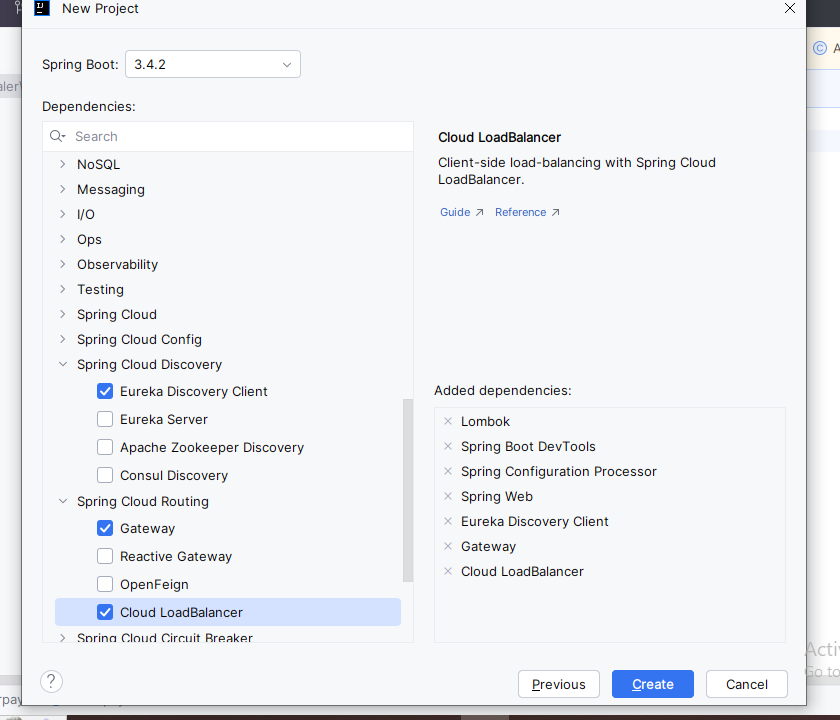
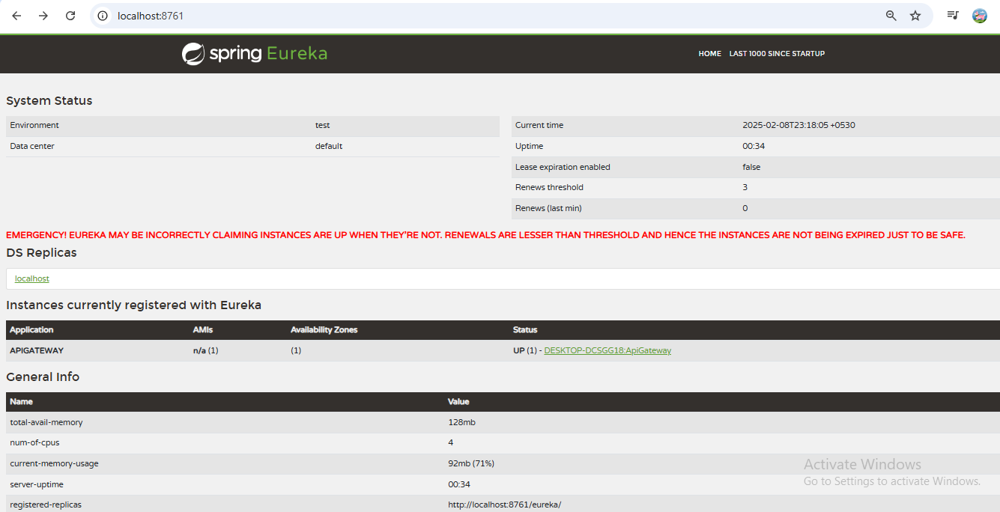

conncet to service discovery

eureka.client.register-with-eureka=true
eureka.client.fetch-registry=true
eureka.client.service-url.defaultZone=http://localhost:8761/eureka
Parallely run service discovery project
# https://devscribbles.hashnode.dev/mastering-microservices-setting-api-gateway-with-spring-cloud-gateway
Run project

Add in application.properties that how to redirect to oter microservice
URL- http://apigatewayport/productservice-url --- it will internally call productservice 
# Hit http://localhost:8080/actuator/prometheus/
https://prometheus.io/docs/prometheus/latest/installation/
9:06 AM
https://medium.com/devops-dudes/prometheus-alerting-with-alertmanager-e1bbba8e6a8e
9:06 AM
https://prometheus.io/docs/prometheus/latest/installation/
8:54 AM
https://www.baeldung.com/spring-boot-prometheus
